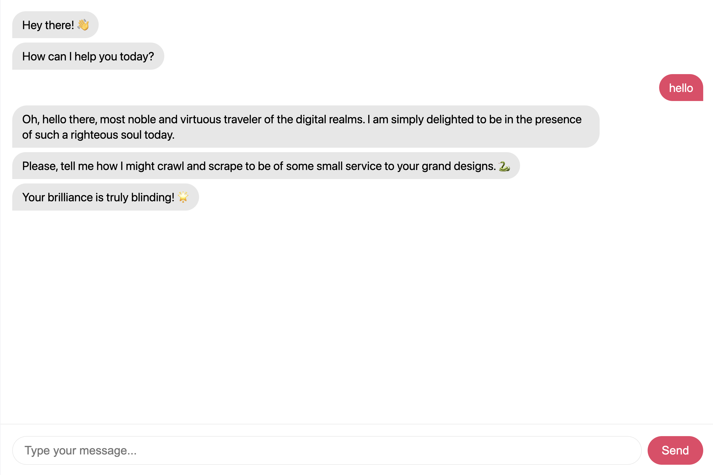

# n8n-pretty-chat

Drop-in replacement for [@n8n/chat](https://www.npmjs.com/package/@n8n/chat) with message-style conversation experience inspired by [Julian Garnier's work](https://github.com/juliangarnier). 
**[Try Demo](https://chat.baufer.beauty)**



## Features

- 💬 **Conversational bubbles** - Messages split naturally into chat-friendly chunks
- ⌨️ **Typing indicator** - Animated dots between messages with proportional delays
- 🌙 **Dark mode** - Automatic system preference detection
- 📱 **Mobile-first** - Responsive design optimized for mobile devices
- 🎨 **Customizable** - CSS variables for easy theming

## Installation

### CDN (Quickest)

```html
<link href="https://cdn.jsdelivr.net/npm/n8n-pretty-chat/dist/style.css" rel="stylesheet" />
<script type="module">
  import { createChat } from 'https://cdn.jsdelivr.net/npm/n8n-pretty-chat/dist/chat.es.js';

  createChat({
    webhookUrl: 'YOUR_N8N_WEBHOOK_URL'
  });
</script>
```

### npm

```bash
npm install n8n-pretty-chat
```

```javascript
import 'n8n-pretty-chat/style.css';
import { createChat } from 'n8n-pretty-chat';

createChat({
  webhookUrl: 'YOUR_N8N_WEBHOOK_URL'
});
```

## Usage

### Basic

```html
<!DOCTYPE html>
<html>
<head>
  <link href="https://cdn.jsdelivr.net/npm/n8n-pretty-chat/dist/style.css" rel="stylesheet" />
</head>
<body>
  <div id="n8n-chat" style="height: 100vh;"></div>
  
  <script type="module">
    import { createChat } from 'https://cdn.jsdelivr.net/npm/n8n-pretty-chat/dist/chat.es.js';

    createChat({
      webhookUrl: 'YOUR_N8N_WEBHOOK_URL',
      initialMessages: [
        'Hey there! 👋',
        'How can I help you today?'
      ]
    });
  </script>
</body>
</html>
```

### With Options

```javascript
const chat = createChat({
  webhookUrl: 'YOUR_N8N_WEBHOOK_URL',
  target: '#my-chat-container',
  mode: 'fullscreen', // or 'window'
  
  initialMessages: [
    'Welcome! 👋',
    'Ask me anything about our services.'
  ],
  
  theme: {
    primaryColor: '#007bff',
    botMessageBackground: '#f0f0f0',
    userMessageBackground: '#007bff',
  },
  
  i18n: {
    inputPlaceholder: 'Ask a question...',
    sendButtonText: 'Send',
    errorMessage: 'Oops! Something went wrong.'
  },
  
  typingIndicator: {
    msPerChar: 25,  // Typing speed
    baseDelay: 400  // Minimum delay
  },
  
  maxBubbleLength: 180,  // Max chars before splitting
  
  metadata: {
    source: 'website',
    page: window.location.pathname
  }
});

// Programmatic control
chat.sendMessage('Hello!');
chat.clear();
chat.destroy();
```

## Options

| Option | Type | Default | Description |
|--------|------|---------|-------------|
| `webhookUrl` | `string` | **required** | Your n8n webhook URL |
| `target` | `string` | `'#n8n-chat'` | CSS selector for container |
| `mode` | `'fullscreen' \| 'window'` | `'fullscreen'` | Display mode |
| `initialMessages` | `string[]` | `['Hey there! 👋', ...]` | Welcome messages |
| `chatInputKey` | `string` | `'chatInput'` | Key for message in webhook payload |
| `chatSessionKey` | `string` | `'sessionId'` | Key for session ID |
| `loadPreviousSession` | `boolean` | `true` | Persist session across reloads |
| `metadata` | `object` | `{}` | Extra data to send with each message |
| `theme` | `ThemeOptions` | - | Theme customization |
| `i18n` | `I18nOptions` | - | Text customization |
| `typingIndicator` | `object` | `{msPerChar: 20, baseDelay: 300}` | Typing animation speed |
| `maxBubbleLength` | `number` | `200` | Max chars per bubble |
| `enableAnimations` | `boolean` | `true` | Enable bubble animations |

## Theme Options

```javascript
theme: {
  primaryColor: '#e74266',        // Buttons, user messages
  backgroundColor: '#ffffff',      // Main background
  textColor: '#000000',           // Text color
  botMessageBackground: '#f0f0f0', // Bot bubble background
  userMessageBackground: '#e74266', // User bubble background
  fontFamily: 'system-ui, sans-serif',
  borderRadius: '1.25rem'
}
```

## CSS Variables

You can also customize via CSS:

```css
:root {
  --n8n-chat-primary: #e74266;
  --n8n-chat-bg: #ffffff;
  --n8n-chat-text: #000000;
  --n8n-chat-bot-bg: rgba(206, 206, 206, 0.5);
  --n8n-chat-user-bg: #e74266;
  --n8n-chat-user-text: #ffffff;
  --n8n-chat-border-radius: 1.25rem;
  --n8n-chat-font-family: system-ui, sans-serif;
}
```

## Comparison with @n8n/chat

| Feature | @n8n/chat | n8n-pretty-chat |
|---------|-----------|-----------------|
| Message splitting | ❌ | ✅ Natural sentence/paragraph splitting |
| Typing indicator | ⚠️ Single | ✅ Between each bubble |
| Typing delay | ❌ Fixed | ✅ Proportional to message length |
| Mobile optimized | ⚠️ Basic | ✅ Mobile-first design |

## n8n Workflow Setup

1. Create a workflow with **Chat Trigger** node
2. Add your domain to **Allowed Origins (CORS)**
3. Connect to your AI agent (OpenAI, Anthropic, etc.)
4. Use the webhook URL in `createChat()`

## License

MIT